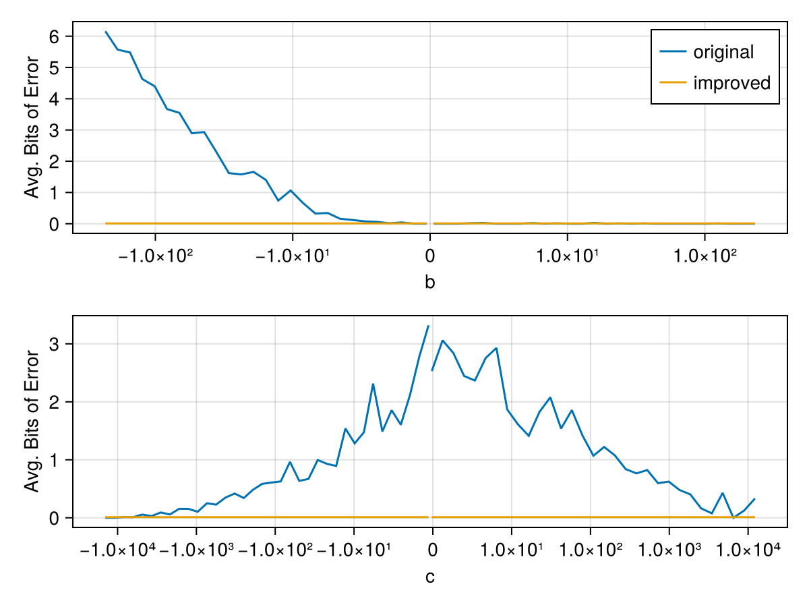

# Developer documentation

OptiFloat.jl implements the Herbie approach to floating point expression
optimization. The steps above are roughly what the `@optifloat` macro is doing
and will be discussed in depth in the rest of this document.

1. Given an initial Julia expression `expr`, compute the [`local_biterror`](@ref OptiFloat.local_biterror) of every subexpression and pick the subexpression `sub_expr` with the worst error for further analysis.
2. Recursively rewrite the `sub_expr` based on a [_set of rewrite rules_](https://github.com/nmheim/OptiFloat.jl/blob/main/src/rules-minus.jl), and simplify with a set of _simplify rules_, generating a number of new [`Candidate`](@ref OptiFloat.Candidate)s.
3. Keep track of all alternatives to `expr` (and their errors) in a list. Pick the next unused expression from that list and start from step 1. Finish after a number of steps or when all alternatives have been tested.
4. Finally, infer good _regimes_: There might not be one expression that performs well for all inputs. OptiFloat.jl (like Herbie) infers good intervals for the different alternative expression and produces one compound expression.


::: details Load packages
```@example report
using DynamicExpressions: parse_expression
using OptiFloat
using Random

# FIXME: sometimes getting NaI in logsample
Random.seed!(1);
```
:::


## Local biterror

OptiFloat.jl computes the _biterror_ of an expression by comparing the _exact
result_ of an expression (computed via
[IntervalArithmetic.jl](https://github.com/JuliaIntervals/IntervalArithmetic.jl))
with the 'normal'/'approximate' result (further called floating point evaluation).

::: details Definition of `biterror`

The `biterror` is defined as the logarithm of the ULP-distance (unit at the last
place) `biterror(x,y) = log2(ulpdistance(x,y))`. For the example above to
approximately 11 bits:

```@repl
using OptiFloat

f(x) = sqrt(x+1) - sqrt(x)
g(x) = 1 / (sqrt(x+1) + sqrt(x))

x = Float16(3730)
OptiFloat.biterror(f(x), g(x))
```

:::

The _local_ biterror is computed by exactly evaluating the input arguments to a
given node `op` in an expression tree, and computing the biterror between the
floating point and exact evaluations of `op`. In order to evaluate all the
operations in an expression tree, we would normally have to walk the tree and
`eval` each node which would be prohibitively slow.  To avoid frequent calls to
`eval` for subexpression evaluation we use
[DynamicExpressions.jl](https://github.com/SymbolicML/DynamicExpressions.jl) as
demonstrated below.

```@example report
using DynamicExpressions

orig_expr = :((b * (-1) - sqrt(b^2 - 4c)) / (2c))
dexpr = parse_expression(orig_expr;
    binary_operators=[-, ^, /, *, +],
    unary_operators=[-, sqrt, exp, abs, cbrt, log],
    node_type=Node{Float16},
    variable_names=["b", "c"],
)

# OptiFloat defines a convenience overload for the above:
dexpr, features = parse_expression(Float16, orig_expr)

# dynamic expressions are callable with batches of inputs:
points = Float16[
    -2 -50;
     1 1;
]
dexpr(points)
```

Errors for all sub-expressions:
```@example report
local_errs = OptiFloat.local_biterrors(dexpr, points)
```


## Sample test inputs

Samples/points are batches of vectors with length `arity(dexpr)`.
Points can be sampled such that only valid inputs to the expression are generated:
```@example report
batchsize = 1000
points = OptiFloat.logsample(dexpr, batchsize; eval_exact=false)
```

The `logsample` function generates logarithmic samples to better cover the space
of floating point numbers (which are more dense close to zero). We can plot the
samples on a logarithmic scale which shows that `b` (x-axis) and `c` (y-axis) are not
sampled where `b^2 - 4c < 0`, because that would result in a `DomainError` in
`sqrt`.

```@example
using DynamicExpressions # hide
using OptiFloat: sample_bitpattern, evaluate_exact, logsample # hide
T = Float16 # hide
orig_expr = :((-b - sqrt(b^2 - (4 * c))) / (2 * c)) # hide
kws = (; # hide
    variable_names=["c", "b"], # hide
    binary_operators=[-, *, /, ^, +], # hide
    unary_operators=[-, sqrt], # hide
    node_type=Node{T}, # hide
) # hide
e1 = parse_expression(orig_expr; kws...) # hide
 # hide
points = logsample(e1, 1000; eval_exact=true) # hide
y1 = e1(points; eval_options=EvalOptions(; early_exit=false)) # hide
let # hide
    using CairoMakie # hide
    using Makie # hide
    (xp, yp) = eachrow(points) # hide
    f = Figure() # hide
    ax = Axis(f[1, 1]; yscale=Makie.Symlog10(1), xscale=Makie.Symlog10(1), xlabel="b", ylabel="c") # hide
    scatter!(ax, xp, yp; label="$orig_expr") # hide
    axislegend(ax; position=:lb) # hide
    f # hide
end # hide
```


## Find better candidate expressions

Create first candidate and kick of `search_candidates!`:
```@example report
original = OptiFloat.Candidate(dexpr, points)
candidates = [original]
OptiFloat.search_candidates!(candidates, points)
```

This step is powered by [*`Metatheory.jl`*](https://github.com/JuliaSymbolics/Metatheory.jl).
First, we pick the worst expression based on the `local_errors`. Then the children of this expression
are (classically) rewritten based on `OptiFloat.REWRITE_RULES`. Subsequently *only the children* of the
worst expression is simplified via [equality saturation](https://juliasymbolics.github.io/Metatheory.jl/dev/egraphs/).

::: details Inspect created candidates and average error on all `points`.
```@repl report
candidates
```
:::


Now we have a few candidates, some of which perform much better on some inputs
than the original expression. If we were to pick the best expression for every
point, we would end up with a lot of costly if statements, and overfit on the
`points` that we evaluated the expression with.  For example, the two best
expressions in this case are:
- The original: `(-b - sqrt(b^2 - 4c)) / (2c)`
- A new candidate: `((4c) / (sqrt(b ^ 2 - 4c) - b)) / (2c)`

We can plot the samples again, now with different colors for the expression that performs better:

```@example
using DynamicExpressions # hide
using OptiFloat: sample_bitpattern, evaluate_exact, logsample # hide
T = Float16 # hide
orig_expr = :((-b - sqrt(b^2 - (4 * c))) / (2 * c)) # hide
candidate = :(((4c) / (sqrt(b^2 - 4c) - b)) / (2c)) # hide
kws = (; # hide
    variable_names=["c", "b"], # hide
    binary_operators=[-, *, /, ^, +], # hide
    unary_operators=[-, sqrt], # hide
    node_type=Node{T}, # hide
) # hide
e1 = parse_expression(orig_expr; kws...) # hide
e2 = parse_expression(candidate; kws...) # hide
 # hide
points = logsample(e2, 1000; eval_exact=true) # hide
 # hide
y1 = e1(points; eval_options=EvalOptions(; early_exit=false)) # hide
y2 = e2(points; eval_options=EvalOptions(; early_exit=false)) # hide
labels = y2 .<= y1 # hide
 # hide
let # hide
    using CairoMakie # hide
    using Makie # hide
    (xp, yp) = eachrow(points) # hide
    f = Figure() # hide
    ax = Axis(f[1, 1]; yscale=Makie.Symlog10(1), xscale=Makie.Symlog10(1), xlabel="b", ylabel="c") # hide
    scatter!(ax, xp[.!labels], yp[.!labels]; label="$orig_expr") # hide
    scatter!(ax, xp[labels], yp[labels]; label="$candidate") # hide
    axislegend(ax; position=:lb) # hide
    f # hide
end # hide
```


## Infer good regimes

To avoid excessive branching/overfitting we try to infer better regimes to split the domain.
```@example report
regimes = OptiFloat.infer_regimes(candidates, features["b"], points)
OptiFloat.print_report(original, regimes; rm_ansi=true)
```

As we can see, OptiFloat splits the domain close to zero, which is exactly what we want.


## Julia function of result expression

You immediately use the Julia function that is printed as part of the result:

```@repl report
improved_expr = OptiFloat.regimes_to_expr(regimes)
improved_func = eval(improved_expr)

improved_func(Float16(-1), Float16(-1))
```

To verify that the resulting `improved_func` is actually performing better you can use the `biterror`
function. The file `scripts/arity-2.jl` contains this workflow as a standalone script, including some
plotting code to generate the error comparison below:


