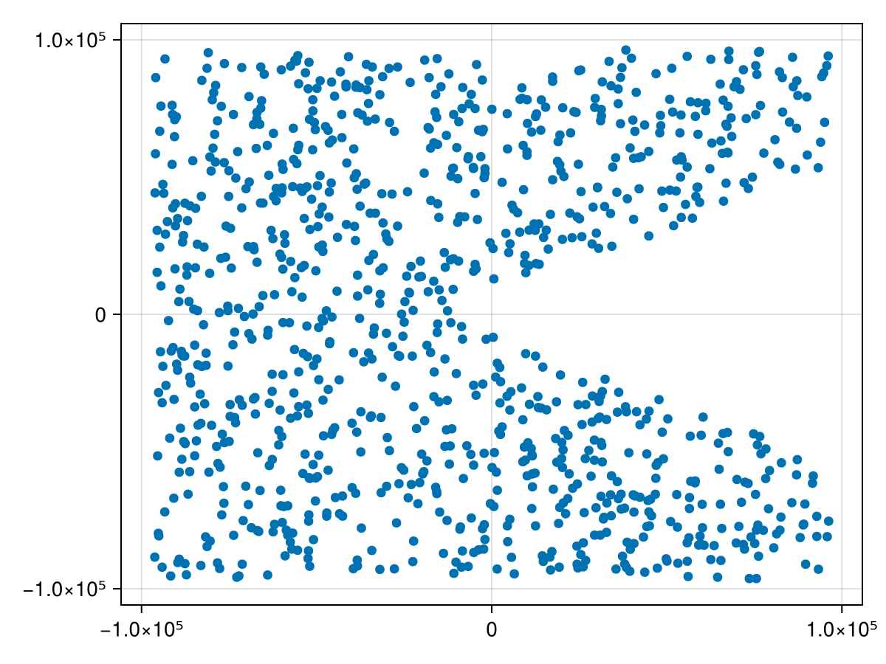
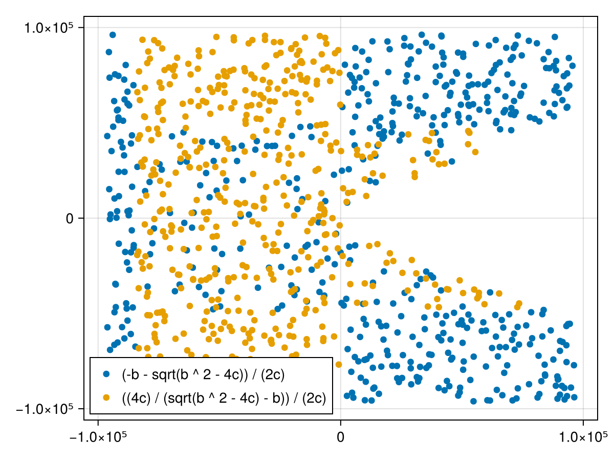
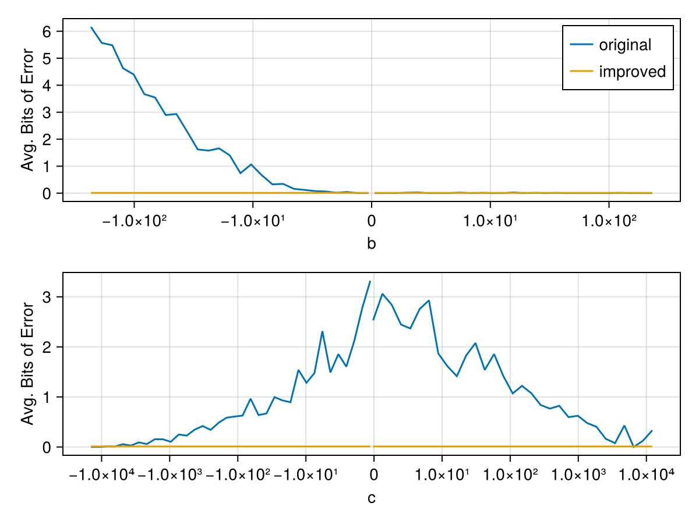

# Workflow

::: details Load packages
```@example report
using DynamicExpressions: parse_expression
using OptiFloat: Candidate, logsample, search_candidates!, infer_regimes, print_report
using Random

# FIXME: sometimes getting NaI in logsample
Random.seed!(1);
```
:::

## `Expression` definition

Define the expression you want to optimize. OptiFloat uses
[`DynamicExpressions.jl`](https://github.com/SymbolicML/DynamicExpressions.jl)
to efficiently compute `local_errors`, so we have to parse a given julia `Expr`
to a `DynamicExpressions.Expression`.  The `features` contain a mapping from
variable name to the index in a sample.
```@example report
T = Float16
expr = :((b * (-1) - sqrt(b^2 - 4c)) / (2c))
dexpr, features = parse_expression(T, expr)
features
```


## Sample test inputs

Samples/points are batches of vectors with length `arity(dexpr)`.
Points can be sampled such that only valid inputs to the expression are generated:
```@example report
batchsize = 1000
points = logsample(dexpr, batchsize; eval_exact=false)
```

The `logsample` function generates logarithmic samples to better cover the space
of floating point numbers (which are more dense close to zero). We can plot the
samples on a logarithmic scale which shows that `b` (x-axis) and `c` (y-axis) are not
sampled where `b^2 - 4c < 0`, because that would result in a `DomainError` in
`sqrt`.




## Find better candidate expressions

Create first candidate and kick of `search_candidates!`:
```@example report
original = Candidate(dexpr, dexpr, points)
candidates = [original]
search_candidates!(candidates, points)
```

::: details Inspect created candidates and average error on all `points`.
```@repl report
candidates
```
:::

Now we have a few candidates, some of which perform much better on some inputs
than the original expression. If we were to pick the best expression for every
point, we would end up with a lot of costly if statements, and overfit on the
`points` that we evaluated the expression with.  For example, the two best
expressions in this case are:
- The original: `(-b - sqrt(b^2 - 4c)) / (2c)`
- A new candidate: `((4c) / (sqrt(b ^ 2 - 4c) - b)) / (2c)`

We can plot the samples again, now with different colors for the expression that performs better:




## Infer good regimes

To avoid excessive branching/overfitting we try to infer better regimes to split the domain.
```@example report
regimes = infer_regimes(candidates, features["b"], points)
print_report(original, regimes; rm_ansi=true)
```

As we can see, OptiFloat splits the domain close to zero, which is exactly what we want.


## Julia function of result expression

You immediately use the Julia function that is printed as part of the result:

```@repl report
using OptiFloat: regimes_to_expr;
improved_expr = regimes_to_expr(regimes)
improved_func = eval(improved_expr)

improved_func(T(-1), T(-1))
```

To verify that the resulting `improved_func` is actually performing better you can use the `biterror`
function. The file `scripts/arity-2.jl` contains this workflow as a standalone script, including some
plotting code to generate the error comparison below:


